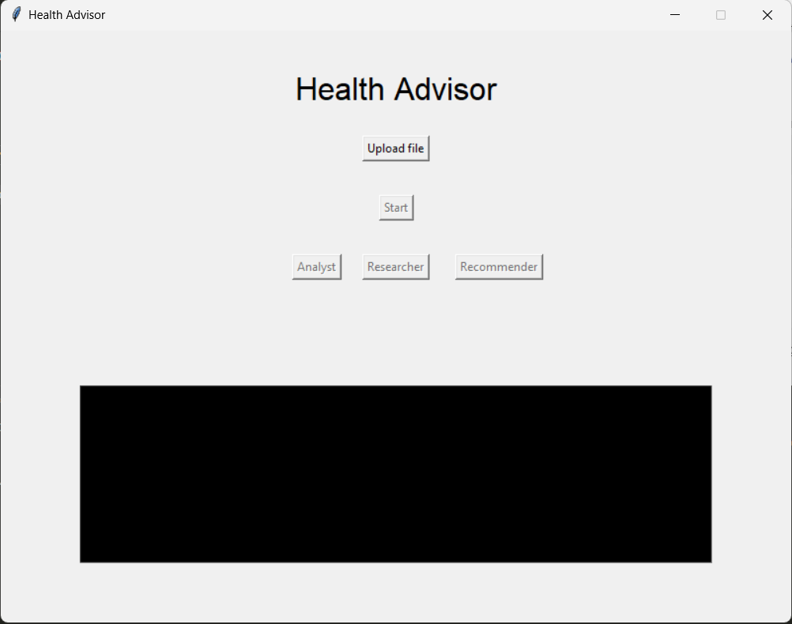

# WingChat-AI

## Project Overview

WingChat-AI is a specialized AI agent designed to analyze blood test reports. The agent, named `report_analyst`, is responsible for extracting relevant data from blood test reports, analyzing the data, and summarizing key health indicators in an easy-to-understand manner. Additionally, it provides personalized recommendations based on the analysis of the blood report. The goal is to provide users with accurate and meaningful insights from their blood test results. It uses the Mistral-7B-Instruct-v0.3 as a large language model from Hugging Face.

## Functionality

- **PDF Parsing**: The agent can extract text from PDF files containing blood test reports.
- **Health Indicator Extraction**: It identifies and extracts key health indicators such as cholesterol levels, blood sugar levels, and cell counts from the extracted text.
- **Summary Generation**: The agent generates concise and easy-to-understand summaries of the extracted health indicators, highlighting any abnormal values or areas of concern.
- **Personalized Recommendations**: Based on the analysis of the blood report, the agent provides personalized health recommendations.

## Features

- **Accurate Data Extraction**: Utilizes advanced text extraction techniques to ensure accurate data retrieval from blood test reports.
- **Medical Terminology Understanding**: Trained to understand medical terminology and health indicators, providing precise insights.
- **User-Friendly Summaries**: Creates summaries that are easy for users to understand, even without a medical background.
- **Personalized Recommendations**: Offers tailored health advice based on the analysis of the blood test data.
- **Non-Delegative**: The agent operates independently without delegating tasks to other agents.
- **Verbose Mode**: Provides detailed output for better traceability and debugging.

## Tech Stack

- **Python**: A high-level programming language that is widely used in AI and machine learning projects.
- **CrewAI Framework**: Agent-based AI framework for building conversational AI agents.
  - **report_analyst Agent**: Specialized agent for analyzing blood test reports.
  - **researcher Agent**: General-purpose agent for conducting research by finding relevant articles.
  - **recommender Agent**: Provides recommendations based on the blood report analysis and researcher agents findings.

## UI Design


## Demo Video
[](https://youtu.be/T284I1yLMtg?si=-hYj16Acsy-X3Yye)

<br>

## Installation
<hr> 

### Prerequisites

- **Hugging face API token with `WRITE` access**
- **Python 3.10 or higher**
- **Virtual Environment Tool** (optional but recommended)

### Steps

1. **Clone the Repository**
    ```bash
    git clone https://github.com/HeetVekariya/WingChat-AI.git
    cd WingChat-AI
    ```

2. **Create a Virtual Environment (optional)**
    ```bash
    python -m venv venv  # On Ubuntu, use `python3` instead of `python`
    venv\Scripts\activate # On Ubuntu, use `source venv/bin/activate`
    ```

3. **Install Dependencies**
    ```bash
    pip install -r requirements.txt
    ```

4. **Crete `.env` File**
    Create a `.env` file in the root directory of the project and add the following configuration:
    ```bash
    HUGGINGFACE_API_TOKEN='<YOUR_HUGGINGFACE_API_TOKEN_WITH_WRITE_ACCESS>'
    ```

5. **Run**
    Execute the `interface` script to run the program.
    ```bash
    python interface.py
    ```

6. **Upload file**
    Upload the blood test report file by clicking on the `Upload File` button.

<br>

7. **Run the analysis**
    Click on the `Run` button to start the analysis of the blood test report. After completion, the indication will be displayed in the black colored text area.

<br>

8. **View the findings**
    To read the findings of the individual agents, click on the respective buttons.


## Usage

To use WingChat-AI, upload your blood test report and run the process. The agent will parse the reports, extract key health indicators, and generate summaries along with personalized recommendations, which will be saved in the `logs.txt`.
